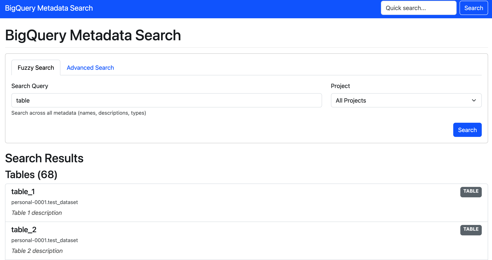

# BigQuery Metadata Search

A tool for extracting and searching metadata from Google BigQuery projects.



## Features

- Extract table and field metadata from BigQuery projects
- Store metadata in a searchable database
- Search interface for finding tables and fields by name or description
- Browsable interface for exploring BigQuery metadata
- RESTful API for programmatic access

## Setup

### Docker Setup (Recommended)

The easiest way to get started is using Docker:

1. Clone this repository
2. Add your Google Cloud credentials in the `credentials` directory:
   ```
   mkdir -p credentials
   cp /path/to/service-account-key.json ./credentials/service-account-key.json
   ```
3. Run the setup script:
   ```
   ./scripts/setup.sh
   ```
4. Extract metadata from your BigQuery project:
   ```
   ./scripts/extract-metadata.sh your-project-id
   ```
5. Access the web interface at http://localhost:8000

### Manual Setup

1. Clone this repository
2. Install uv and dependencies:
   ```
   pip install uv
   uv pip install -e .
   ```
3. Configure your GCP credentials:
   ```
   export GOOGLE_APPLICATION_CREDENTIALS=/path/to/service-account-key.json
   ```
4. Extract metadata:
   ```
   python -m app.extractor.run --project=your-project-id
   ```
5. Run the application:
   ```
   uvicorn app.main:app --reload
   ```
6. Access the web interface at http://localhost:8000

## Usage

See [./docs/USAGE.md](USAGE.md) for detailed usage instructions.

## Project Structure

- **app/extractor**: BigQuery metadata extractor
- **app/storage**: Database models and operations
- **app/search**: Search functionality
- **app/api**: REST API
- **app/web**: Web interface

## Architecture

- **Extractor**: Connects to BigQuery and extracts metadata
- **Storage**: Persists metadata in a database (PostgreSQL or SQLite)
- **Search**: Provides search capabilities
- **API**: FastAPI-based REST API
- **Web**: User interface for searching and browsing metadata

## Future Enhancements

Potential improvements for future versions:

1. **Authentication & Authorization**: Add user authentication and role-based access control
2. **Scheduled Extraction**: Automatically update metadata on a schedule
3. **Metadata Diff**: Track changes in metadata over time
4. **Tagging System**: Allow users to add custom tags to tables and fields
5. **Data Lineage**: Track relationships between tables
6. **Advanced Visualization**: Add visualization of table relationships
7. **Search History**: Store and suggest recent searches
8. **Export Functionality**: Export search results in various formats
9. **Elasticsearch Integration**: For more powerful search capabilities
10. **Schema Evolution**: Track changes to table schemas over time

## License

This project is licensed under the MIT License.
